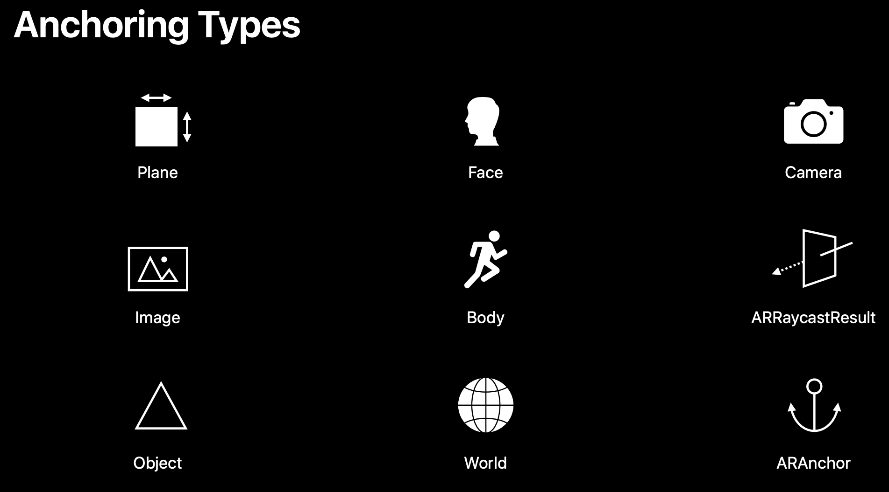

* 2D人体动作识别（机器学习）

  https://developer.apple.com/documentation/coreml/detecting_human_body_poses_in_an_image

* Reality Kit

  https://developer.apple.com/documentation/realitykit

* Building Apps with RealityKit

  https://developer.apple.com/videos/play/wwdc2019/605/

* 制作3D Content

  https://developer.apple.com/documentation/realitykit/creating_3d_content_with_reality_composer

* Creating an Immersive AR Experience with Audio

  https://developer.apple.com/documentation/arkit/creating_an_immersive_ar_experience_with_audio

* Placing Objects and Handling 3D Interaction

  https://developer.apple.com/documentation/arkit/environmental_analysis/placing_objects_and_handling_3d_interaction

* 创建人体3d

  https://developer.apple.com/documentation/arkit/content_anchors/validating_a_model_for_motion_capture

  https://developer.apple.com/documentation/arkit/content_anchors/rigging_a_model_for_motion_capture

* 

AR中支持的Anchoring Types

 

#### 创意：

1. AR跳舞毯
2. 潜水艇大挑战
3. 

#### 限制：

* ARKit requires iOS 11.0 or later and an iOS device with an A9 or later processor.

* 体感游戏失败案例：Kinect

  * 游戏占地面积大

  * 没有杀手级的应用

  * 只能玩休闲类的轻度游戏

    