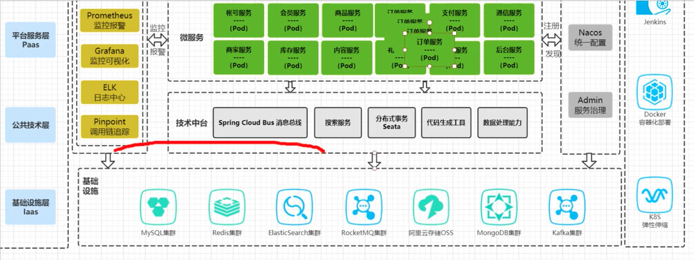

1. Redis命令参考手册，SETNX

   > 1. synchronized是jvm级别的锁
   >
   > 2. 分布式锁
   >
   >    > 1. 通过SETNX可以简单创建一个分布式锁
   >    > 2. 多线程请求到Redis的命令是排队单线程执行的
   >    > 3. SETNX创建的是一个简单的乐观锁？
   >    > 4. SETNX中间抛出异常可能导致死锁
   >    > 5. try catch可解决4的问题，但是宕机了（可能运维重启）怎么办呢？
   >    > 6. 设置key过期时间可解决5的问题，但是还没执行设置过期就宕机了怎么办呢？
   >    > 7. 用Redis的原子性方法
   >    > 8. 但6中的方法可能导致锁超时问题，即业务还未进行完但Redis把key删除了，其他线程任务进来篡改数据
   >    > 9. 6中的方法还可能导致A任务超时后，B拿到锁，但是在A的final中又把B的锁给删除了
   >    > 10. 9的解决方案是给value设置为本机的一个标识，删除key的时候判断该value是不是本机的标识
   >    > 11. 8的问题用锁续命来解决，即新开一个线程跟踪业务线程看是否结束，没结束则给锁续命

2. redisson Redis的Java客户端，提供一些工业级的现成的分布式解决方案

3. jedis什么东西

4. redisson实现分布式锁原理

   

5. Lua脚本在Redis里面执行是具有原子性的

6. 从4中的图里面可以看出分布式锁会对性能有一定影响，因为未加锁成功的一直排队等着

   1. 分段锁，即将库存分段上锁，单个段扣完了怎么处理？
   2. 队列？

7. Redis主从，主机宕机后，主机的lock还未来得及同步给从节点，导致两个业务线程进行

8. 宕机，定时人工脚本补偿？库存比对脚本修正数据？

9. AP架构（Redis）保证可用性、CP架构（Zookeeper）保证一致性

10. Zookeeper特点，处理主从同步问题（当加一个锁给主节点，主节点会同步锁给子节点，当超过半数的节点都同步了才会返回给客户端表示上锁成功，当主机挂了后，会选举已经上锁的那台从节点作为新的主节点（question，如果AB两个锁各在node1和node2上，那该选谁来作为主节点呢，这样不是也由于主从同步问题吗））

11. 小七老师Zookeeper底层原理

12. Redis性能比Zookeeper高，Redis单节点的QPS能够达到好几万接近10万，Zookeeper能上万就不得了了，但是Zookeeper的健壮性更好一些

13. RedLock解决Redis中的主从同步问题，借鉴了Zookeeper，Redis是取消主从架构，直接平级

    

14. 缓存操作流程

     

15. 双写不一致流程演示

     

    1. 双删？

    2. 不用缓存

    3. 读写锁

       > * 写的时候都不准读
       >
       > * 读的时候都可以读，但是不能写

#### 问题

1、手动模拟高并发场景秒杀下单超卖Bug

2、秒杀场景下实战JM级别锁与分布式锁

3、大厂分布式锁 Redisson框架实战 

4、从 Redisson源码剖析ua解决锁的原子性问题

 5、 Redis主从架构锁失效问题及 Redlocki详解 

6、双十ー火促如何将分布式锁性能提升100倍 

7、从CAP角度剖析 Redise& Zookeeper锁架构异同

 8、 Redis缓存与数据库双写不ー致终极解决

参考资料：https://www.bilibili.com/video/BV1vi4y1V7se?p=6&spm_id_from=pageDriver

#### 问题：多线程高并发底层锁机制与优化最佳实践

1、从 Hotspot?源码看下并发同步原语设计机制 

2、十分钟讲透无锁&偏向锁&轻量级锁&重量级锁
3、从汇编底层深度理解CAS自旋锁与ABA问题
4、从 Hotspot.底层对象结构理解锁膨胀升级过程
5、深入JDK源码理解 Longaddere的分段CAS优化机制 

6、区别于 Synchronized的LOck底层AQS机制解析
7、BAT大厂高并发项目锁优化最佳实践

参考资料：https://www.bilibili.com/video/BV1vi4y1V7se?p=9

1. synchronized 同步锁、互斥锁、悲观锁、重量级锁

2. CAS compare and swap，即保留的旧值与内存中的值比较，若相等则设新值，否则重复（也叫无锁（硬件级别还是上了锁（保证compare and set是个原子操作））、自旋锁、乐观锁、轻量级锁）

3. 1和2可类比为开车，1的红绿灯多，启停油耗大耗时多，2虽然路长一点，但是一直开不用停，反而油耗更低

4. LongAdd --分段cas提升性能

5. 原子性问题：compareAndSet可能涉及多步操作，compare和set之间可能被其他线程修改了值（注意：AtomicInteger的compareandset实际上是原子的）

6. ABA问题：加版本号解决

7. jdk1.6之后对synchronized加了很多优化，涉及锁的几种状态

   1. 无状态

      > 对象刚生成是处于无状态的，等一段时间（延时时间可通过XX: Biasedlockingstartupdelay=0来设置）后JVM会把偏向标志位设置为1，即可偏向
      >
      > 如果不要偏向锁可通过XX: -Usebiasedlocking=false来设置

   2. 偏向锁

   3. 轻量级锁

   4. 重量级锁

       

8. 对象的内部结

   构

9. 对象头的内容

    

10. 通过jol-core插件可以打出Object对象内部的组成结构

11. 对象占用空间为什么要是8的整数倍

    > 方便寻址，提高效率，牺牲一点空间提升整体性能

12. 微服务架构

     

     

​      

#### 问题

 

1. AQS AbstractQueuedSynchronizer 线程安全同步机制里面扮演着非常重要的角色，类似于spring在整个项目中所占的角色

2. unsafe对象通过反射取得，该对象的方法是直接操作底层硬件，所以unsafe

3. Java中锁的类型

    

4. 手写一个类似synchronized功能的锁

5. 可重入与不可重入

   > 锁能否被线程反复的持有

6. 公平与非公平

   > 是否先到先得

7. 为什么要创建AbstractQueuedSynchronizer的继承类作为锁的内部类来使用？体现了一种什么样的设计思想？

8. CLH队列