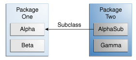

1. As a platform-independent environment, the Java platform can be a bit slower（？） than native code（native code指什么）.

2. Java platform？

   > java platform 由Java API（Java Application Programming Interface）和 JVM组成

3. Field 可以有多个修饰符

4. Java建议成员变量采用private修饰，通过public修饰的getter和setter方法来访问成员变量

5. 可以采用下划线来分割较长的数字

6. 方法的签名：calculateAnswer(double, int, double, double)，就是方法名字和后面的一串参数

7. 参数顺序对签名有没影响？

   > 类型顺序有影响

8. 少用方法重载，降低可读性

9. `new Bicycle(30, 0, 8)` creates space in memory for the object and initializes its fields.

10. 可变参数：methodName(ArgType... args),这里既可以传一串参数，也可以传一个数组（可变参数是否可以放在中间？）

   > 不可以，必须放在最后

11. Java传参时，无论是基础数据类型还是引用类型传参，都是值传递，也就是在函数内部并不能改变引用的指向

12. 系统如何回收使用完的对象

   An object is **eligible** for garbage collection when there are no more references to that object. References that are held in a variable are usually dropped when the variable goes out of scope. Or, you can explicitly drop an object reference by setting the variable to the special value `null`. Remember that a program can have multiple references to the same object; all references to an object must be dropped before the object is eligible for garbage collection.

   The Java runtime environment has a garbage collector that **periodically** frees the memory used by objects that are no longer referenced. The garbage collector does its job automatically when it determines that the time is right. 

13. 如果函数的参数名跟成员变量名相同，参数名会覆盖成员变量名，所以得使用this

14. 在构造函数中可以使用this去访问其他的构造函数（If present, the invocation of another constructor must be the first line in the constructor.）

15. access control：（**防止误用导致发生错误**）

    * 对于类而言
      * public，随处可用
      * default/package-private，在整个包内都可以访问
      
    * 对于成员变量而言
      * public，随处可用
      * protected，包中可以访问，其他包中的子类也可以访问
      * default/package-private ，包中可以访问
      * private，仅在自己类中可以调用
      
      
      
      | Modifier    | Alpha | Beta | Alphasub | Gamma |
      | ----------- | ----- | ---- | -------- | ----- |
      | `public`    | Y     | Y    | Y        | Y     |
      | `protected` | Y     | Y    | Y        | N     |
      | no modifier | Y     | Y    | N        | N     |
      | `private`   | Y     | N    | N        | N     |

| Modifier    | Class | Package | Subclass | World |
| ----------- | ----- | ------- | -------- | ----- |
| `public`    | Y     | Y       | Y        | Y     |
| `protected` | Y     | Y       | Y        | N     |
| no modifier | Y     | Y       | N        | N     |
| `private`   | Y     | N       | N        | N     |

- Use the most restrictive access level that makes sense for a particular member. Use `private` unless you have a good reason not to.
- Avoid `public` fields except for constants.Public fields tend to link you to a particular implementation and limit your flexibility in changing your code.

14. **Note:** You can also refer to static fields with an object reference like

    ```
    myBike.numberOfBicycles
    ```

    but this is discouraged because it does not make it clear that they are class variables.

15. 实例函数可以直接访问静态变量和静态方法，反之不能。

16. 定义一个常量 static final type filedname

17. **Note:** If a primitive type or a string is defined as a constant and the value is known at compile time, the compiler replaces the constant name everywhere in the code with its value. This is called a *compile-time constant*. If the value of the constant in the outside world changes (for example, if it is legislated that pi actually should be 3.975), you will need to recompile any classes that use this constant to get the current value.（编译时常量、基础数据类型）

18. **Note:** It is not necessary to declare fields at the beginning of the class definition, although this is the most common practice. It is only necessary that they be declared and initialized before they are used.

19. the Java programming language includes *static initialization blocks*.（how to？）

20. 可以在类中的任意位置定义一个静态代码块,静态代码块在源代码中的位置决定了执行顺序，这一点由运行时系统来保证，静态代码块可以用来初始化静态变量，同样也可以使用静态方法，并且静态方法可以被重复调用以赋予静态变量新的值

    ```java
    static {
        // whatever code is needed for initialization goes here
    }
    ```

21. 类似于静态代码块，代码块可以用来给成员变量进行初始化，它自动被编译器放进构造方法中，所以他是可以被重用的，或者通过final修饰的函数来进行成员变量初始化，The method is final because calling non-final methods during instance initialization can cause problems.

    ```java
    {
        // whatever code is needed for initialization goes here
    }
    ```

    22. This technique, called *covariant return type*, means that the return type is allowed to vary in the same direction as the subclass.（协变返回类型）

    23. **绑定类**，绑定类分为两种

        > 1. 静态绑定类
    > 2. 非静态绑定类（内部类），内部类有两种特殊的类
        >    1. 本地类
    >    2. 匿名类
    
    24. because an inner class is associated with an instance, it cannot define any static members itself.
    
25. 一般内嵌类的实例只有在外部类实例化后，通过外部类的实例来实例化内部类，如下
  
    ```java
        OuterClass.InnerClass innerObject = outerObject.new InnerClass();
    ```
    
26. 当内嵌类的成员变量或者方法和外部类同名时，在内部类中单纯的使用同名名字来访问变量会导致覆盖（即访问的是内部成员变量），若要访问外部类的成员变量，方法如下
  
    ```java
        OutClass.this.fildName
    ```
    
27. To handle user interface events, you must know how to use inner classes, because the event-handling mechanism makes extensive use of them.(事件处理机制广泛的用到了inner class)
  
28. 位于代码块内部，有名字的类为局部类，没有名字的类叫匿名类
  
29. 局部类可以访问其外部类的成员变量
  
30. 在Javase8以后，局部类可以访问其所在代码块的参数以及局部变量，前提是参数和局部变量都是被final修饰的，或者是effectively final的，因为捕获？怎么讲？
  
31. 类似内部类，局部类也不能定义任何的静态成员，如果一个局部类位于外部类的静态方法中，那么这个局部类中只能访问外部类的静态成员
  
32. 因为局部类有访问实例变量的权利，所以他就没法被定成静态的了
  
33. interface天生静态，所以不能在方法中定义interface
  
34. 当局部类其成员为*constant variable*的时候，其成员可以使静态的
  
35. A *constant variable* is a variable of primitive type or type `String` that is declared final and initialized with a compile-time constant expression. A compile-time constant expression is typically a string or an arithmetic expression that can be evaluated at compile time.
  
    36. **匿名类**
    
    37. the anonymous class expression consists of the following:

        - The `new` operator
    - The name of an interface to implement or a class to extend. In this example, the anonymous class is implementing the interface `HelloWorld`.
        - Parentheses that contain the arguments to a constructor, just like a normal class instance creation expression. **Note**: When you implement an interface, there is no constructor, so you use an empty pair of parentheses, as in this example.
    - A body, which is a class declaration body. More specifically, in the body, method declarations are allowed but statements are not.
    
    38. However, you cannot declare constructors in an anonymous class.局部类中呢？
    
    39. 匿名类适用于：1-方法中仅有一个类，2-有多个函数实现（只有一个函数实现可以用lambda表达式替代）
    
    40. 匿名类中不能定义构造方法，那么内部类和局部类呢？->可以定义
    
    41. 当方法中的一个局部变量和方法中的一个局部类中的一个变量重名时，shadow是怎么表现的
    
        > 默认访问局部类中的变量，无法访问方法中的局部变量

##### nested class

* nested class
  * static nested class
    * 能否访问外部类的非静态成员-no
    * 能否访问外部类的静态成员-yes
    * 外部类能否访问其静态成员-yes
    * 外部类能否访问其非静态成员-yes
    * 何时用这个类（同实例变量与静态变量的区别）
  * non-static nested class（inner class）
    * 能否访问外部类的非静态成员-yes
    * 能否访问外部类的静态成员-yes
    * 外部类能否访问其静态成员-(inner class 中不能定义静态成员)
    * 外部类能否访问其非静态成员-yes
    * 何时用这个类（在外部类中全局使用时用这个，只在某个方法中使用时用local class，只在某个方法中使用一次时用anonymous class）
  * local class
    * 类似于inner class，不同点是他的内部可以定义static 常量
  * anonymous class
    * 匿名类中不能定义构造方法

1. why use nested class
   - **It is a way of logically grouping classes that are only used in one place**
   - **It increases encapsulation**
   - **It can lead to more readable and maintainable code**:
2. 关于内部类的序列化？https://docs.oracle.com/javase/tutorial/java/javaOO/nested.html
3. 局部类跟inner class 一样不能定义静态成员，局部类位于静态方法时，只能访问外部类的静态成员

##### lambda表达式（需要进一步加强）

1. 说到底，lambda表达式就是一个函数（样子已经给你定好了，怎么实现你来定）
2. 泛型的作用，约束几个值的类型统一性，但不对值具体是什么类型做约束
3. 跟local class 和 anonymous class 不同的是，lambda表达式没有新开一个域，所以不存在值覆盖的问题。
4. For method arguments, the Java compiler determines the target type with two other language features: overload resolution（重载解析） and type argument inference（类型参数推断）.

##### method reference

1. 避免同样的操作内容多次编写

##### Enum

1. Java中的枚举是一个类，隐式的继承于java.lang.Enum
2. Java中的枚举可以定义方法
3. 当枚举类中含有filed或者方法的时候，枚举列表结束时需要以分号结尾
4. The constructor for an enum type must be package-private or private access. It automatically creates the constants that are defined at the beginning of the enum body. You cannot invoke an enum constructor yourself.

#### 注解 Annotation

1. *Annotations*, a form of metadata, provide data about a program that is not part of the program itself. Annotations have no direct effect on the operation of the code they annotate.（关于注解的概念，他就是元数据的一种表现形式，给程序提供一些数据，程序怎么用这些数据？）

   > 通过反射API获取注解中的数据

2. 注解可以包含多个元素，这些元素可以命名也可以不命名（多个元素不命名的话怎么区分？），单个元素时可以省略元素名（The annotation can include *elements*, which can be named or unnamed, and there are values for those elements:）

3. 在一段代码上加多个类型相同的注解叫做重复注解

4. unchecked warnings 哪种情况下产生

   > warning有很多类型，如unchecked、deprecated...，数组未进行参数化就会产生unchecked warning

5. and the user queries the annotation type on a class declaration怎么解释？

   > 

6. how to define a custom type check Annotation？

7. 自定义一个可以repeat的Annotation（For compatibility reasons, repeating annotations are stored in a *container annotation* that is automatically generated by the Java compiler. In order for the compiler to do this, two declarations are required in your code.为什么这样就满足兼容性了？）

   ```java
   import java.lang.annotation.Repeatable;
   
   //定义一个可重复的注解
   @Repeatable(Schedules.class)//这里表示，该注解放在Schedules中
   public @interface Schedule {
     String dayOfMonth() default "first";
     String dayOfWeek() default "Mon";
     int hour() default 12;
   }
   
   //定义一个容器注解
   public @interface Schedules {
       Schedule[] value();
   }
   ```

8. 设计自定义注解的原则：It is important to design your annotation type carefully to ensure that the programmer *using* the annotation finds it to be as flexible and powerful as possible.

##### Interface

1. 接口中的函数默认是public修饰，因此可以省略

2. All constant values defined in an interface are implicitly `public`, `static`, and `final`

3. 接口中定义一个带默认实现的方法（带默认实现的方法不强制其实现类必须实现该方法）

   ```java
   //带默认实现的方法需要用default修饰，
   default boolean didItWork(int i, double x, String s) {
         // Method body 
   }
   ```

4. 如何扩展(发展)一个接口

   1. 

      ```java
      public interface DoIt {
         void doSomething(int i, double x);
         int doSomethingElse(String s);   
      }
      
      public interface DoItPlus extends DoIt {
         boolean didItWork(int i, double x, String s);   
      }
      ```

   2. 

      ```java
      public interface DoIt {
         void doSomething(int i, double x);
         int doSomethingElse(String s);
         //带默认实现后，就不会强制其实现类实现该方法了
         default boolean didItWork(int i, double x, String s) {
             // Method body 
         }   
      }
      ```

5. 如果你扩展了一个包含default方法的接口，那么你可以对这个default方法做以下三种操作

   - Not mention the default method at all, which lets your extended interface inherit the default method.（直接继承过来）
   - Redeclare the default method, which makes it `abstract`.（搞成抽象方法）
   - Redefine the default method, which overrides it.（重写）

6. **static method**：This makes it easier for you to organize helper methods in your libraries

7. 接口中定义的静态方法必须有方法体，且该静态方法只能由这个接口调用（不用用其实现类调用，更别提重写）

8. default method加强：https://docs.oracle.com/javase/tutorial/java/IandI/defaultmethods.html

##### 继承

1. A subclass inherits all the *members* (fields, methods, and nested classes) from its superclass. Constructors are not members, so they are not inherited by subclasses, but the constructor of the superclass can be invoked from the subclass.
2. Java不让使用多继承的原因是避免产生继承多个field
3. The Java compiler provides some rules to determine which default method a particular class uses.（how？）
4. 
final关键字对于方法而言，标志这个方法不能被重写；对于类而言，标志这个类不能被继承
2. 一般来讲，被构造方法调用的方法我们都建议用final修饰，以避免在子类中修改后导致出错
3. 一个抽象类中可能包含抽象方法，也可能包含非抽象方法，抽象类不能被实例化，但是可以被继承（一个包含抽象方法的类一定是抽象类）


##### 泛型（存在很多疑点）

1. 泛型增加代码稳定性，如何增加？（making more of your bugs detectable at compile time）

2. 为什么要使用泛型

   1. Stronger type checks at compile time.（具体如何进行的？）

   2. 消除类型转换

      ```java
      The following code snippet without generics requires casting:
      List list = new ArrayList();
      list.add("hello");
      String s = (String) list.get(0);
      When re-written to use generics, the code does not require casting:
      List<String> list = new ArrayList<String>();
      list.add("hello");
      String s = list.get(0);   // no cast
      ```

   3. 实现通用算法
   
3. 泛型放的位置

   1. 类

      ```java
      public class Hello<T>{...}
      Hello hello = new <Person>Hello();
      ```

   2. 接口

      ```java
      public interface Hello<T>{...}
      public class Person implementation Hello<He>{...}
      ```

   3. 方法

      ```java
      //直接使用类的泛型
      public class Pair<K, V> {
          private K key;
          private V value;
          public Pair(K key, V value) {
              this.key = key;
              this.value = value;
          }
      }
      Pair<Integer, String> p1 = new Pair<>(1, "apple");
      
      //直接自己的泛型
      public class Util {
          public static <K, V> boolean compare(Pair<K, V> p1, Pair<K, V> p2) {...}
      }
      Util.<Integer, String>compare(p1, p2);
      ```

4. 类型的界分一般性的界，这个用在声明泛型的时候

   ```java
   //声明泛型
   public interface Action<T extends HE>{...}
   
   //使用泛型(这里的HI也是HE的子类)
   public class Dog implementation Action<? extends HI>{...}
   ```

5. 要么定义上限要么定义下限，不能同时定义

6. **Wildcard Guidelines:** 

   - An "in" variable is defined with an upper bounded wildcard, using the `extends` keyword.
   - An "out" variable is defined with a lower bounded wildcard, using the `super` keyword.
   - In the case where the "in" variable can be accessed using methods defined in the `Object` class, use an unbounded wildcard.
   - In the case where the code needs to access the variable as both an "in" and an "out" variable, do not use a wildcard.

7. To use Java generics effectively, you must consider the following restrictions:

   - [Cannot Instantiate Generic Types with Primitive Types](https://docs.oracle.com/javase/tutorial/java/generics/restrictions.html#instantiate)
   - [Cannot Create Instances of Type Parameters](https://docs.oracle.com/javase/tutorial/java/generics/restrictions.html#createObjects)
   - [Cannot Declare Static Fields Whose Types are Type Parameters](https://docs.oracle.com/javase/tutorial/java/generics/restrictions.html#createStatic)
   - [Cannot Use Casts or `instanceof` With Parameterized Types](https://docs.oracle.com/javase/tutorial/java/generics/restrictions.html#cannotCast)
   - [Cannot Create Arrays of Parameterized Types](https://docs.oracle.com/javase/tutorial/java/generics/restrictions.html#createArrays)
   - [Cannot Create, Catch, or Throw Objects of Parameterized Types](https://docs.oracle.com/javase/tutorial/java/generics/restrictions.html#cannotCatch)
   - [Cannot Overload a Method Where the Formal Parameter Types of Each Overload Erase to the Same Raw Type](https://docs.oracle.com/javase/tutorial/java/generics/restrictions.html#cannotOverload)

##### package

1. package 是一组相关的类或接口的集合

2. `package`关键字开头，后跟包的路径

   ```java
   package graphics;
   ```

3. ```java
   //这导入了Rectangle下的内部类，但是Rectangle并未被导入
   import graphics.Rectangle.*;
   ```

4. The prefix `java.awt` (the Java Abstract Window Toolkit) 

5. 包的路径上的层次关系并不意味着有包含关系

6. 引入两个不同的包，但包含两个相同的类时，要使用该类的全称加区分

   ```java
   import java.awt.*;
   import graphics
   graphics.Rectangle rect;
   ```

7. import static xxxx,引入包下的静态内容（静态方法和静态变量 etc.），这样在使用这些静态成员时就不需要加类前缀了，但应该谨慎使用，用多了降低代码阅读性

8.  Setting the CLASSPATH System Variable

   To display the current `CLASSPATH` variable, use these commands in Windows and UNIX (Bourne shell):

   ```
   In Windows:   C:\> set CLASSPATH
   In UNIX:      % echo $CLASSPATH
   ```

   To delete the current contents of the `CLASSPATH` variable, use these commands:

   ```
   In Windows:   C:\> set CLASSPATH=
   In UNIX:      % unset CLASSPATH; export CLASSPATH
   ```

   To set the `CLASSPATH` variable, use these commands (for example):

   ```
   In Windows:   C:\> set CLASSPATH=C:\users\george\java\classes
   In UNIX:      % CLASSPATH=/home/george/java/classes; export CLASSPATH
   ```

9. 构造方法中使用到的函数推荐定义为final，防止在子类中修改后造成不可预期的结果

##### JavaBeans

1. A bean is a Java class with method names that follow the JavaBeans guidelines


JPA：Java Persistent API 即Java持久层的API

额外的学习内容

https://docs.oracle.com/javase/tutorial/extra/


#### 并发

 ##### section 1

1. 进程和线程的概念，共同点与区别

   > **Process**
   >
   > > A process has a self-contained execution environment. A process generally has a complete, private set of basic run-time resources; in particular, each process has its own memory space.
   > >
   > > Processes are often seen as synonymous with programs or applications. However, what the user sees as a single application may in fact be a set of cooperating processes. To facilitate communication between processes, most operating systems support *Inter Process Communication* (IPC) resources, such as pipes and sockets. IPC is used not just for communication between processes on the same system, but processes on different systems.
   >
   > **Thread**
   >
   > > Threads are sometimes called ***lightweight processes***. **Both processes and threads provide an execution environment, but creating a new thread requires fewer resources than creating a new process**.
   > >
   > > Threads exist within a process — every process has at least one. Threads share the process's resources, including memory and open files. This makes for efficient, but potentially problematic, communication.
   > >
   > > Multithreaded execution is an essential feature of the Java platform. Every application has at least one thread — or several

2. 定义一个线程对象的两种方式
   1. 一个继承自Thread并实现自己的run方法的线程类
   2. 一个实现了Runnable协议的类，其创建的实例作为Thread的一个构造参数实例化一个线程对象

3. 通过sleep进行线程阻塞

4. 中断，Interrupt
   1. 如何中断一个线程

      > ```java
      > //设置当前线程为打断状态
      > Thread.currentThread().interrupt();
      > ```

   2. 如何获取中断状态

      > ```java
      > //返回当前线程是否被打断，并不清空状态
      > Thread.currentThread().isInterrupted();
      > 
      > //返回当前线程是否被打断，并将状态清空
      > Thread.interrupted();
      > ```

5. 通过Join等待一个线程结束

   > t.join，这句代码的效果是：执行这句代码的线程的后续的语句要等到t结束之后才会执行

##### section 2（同步、通信）

1. 线程间通信通过访问线程对象的field和field所引用到的对象来进行通信，由此产生两个问题，线程间干扰和内存不一致错误，需要一个工具来阻止这两个错误的产生，这个工具就是Synchronization，而这个Synchronization又产生了一个问题就是线程争用（形式分为：死锁、饥饿锁、活跃锁）

   1. 线程间干扰产生的原因

      > https://docs.oracle.com/javase/tutorial/essential/concurrency/interfere.html

   2. 关于Happens-before关系的定义

      > https://docs.oracle.com/javase/specs/jls/se7/html/jls-17.html#jls-17.4.5
      >
      > Happens-before relationship是一个保证，保证一条执行内存写操作的语句对于另外的特定的语句是可见的。如何建立这种关系呢？Synchronization是方法之一，
   
2. 什么是内存一致性错误

3. Synchronization的作用

   > - First, it is not possible for two invocations of synchronized methods on the same object to interleave. When one thread is executing a synchronized method for an object, all other threads that invoke **synchronized methods **for the same object block (suspend execution) until the first thread is done with the object.
   > - Second, when a synchronized method exits, it automatically establishes a happens-before relationship with *any subsequent invocation* of a synchronized method for the same object. This guarantees that changes to the state of the object are visible to all threads.

4. Synchronization和固有锁的关系

5. Atomic Access，原子操作类似于事务操作，即一系列操作要么全部进行完，要么完全不进行。

   > 原子操作能够避免线程干扰，但是不能避免内存一致性错误

##### Section 3（保护块、不可变对象）

1. `wait()`、`notify()`、`notifyAll()`
2. 不可变对象更加稳定可靠、不需要考虑同步和内存一致性问题，同时创建对象对机器的消耗被高估（1. 减少保护代码降低了开销；2.垃圾回收机制而减少的开销）


死锁、饿死锁、活跃锁、Synchronization导致的效率低下问题（Liveness）

##### Section 4（高级并发对象）

1. `Lock`

   > `Lock`中有`lock()`、`tryLock()`、`tryLock(long time,TimeUnit unit)`这三个函数，其中`tryLock()`与另外两个函数的不同之处在于如果该函数获取锁失败的话，不会使线程进入休眠状态。
   
2. Executor 之线程池

   > 为何要有线程池这个东西？因为线程的创建和销毁会引起较大的内存开销，所以线程池通过对线程的复用来进行优化

3. Fork/Join框架

   > 可利用该框架将一个任务分成多个小块，并利用多线程进行处理。


 

javabean规范

> 1、所有属性为private
> 2、提供默认构造方法
> 3、提供getter和setter
> 4、实现serializable接口


参考文档：

* [The Java Language Environment: Contents 白皮书](https://www.oracle.com/java/technologies/language-environment.html)
  * [Java 官方文档](https://docs.oracle.com/javase/tutorial/)
* [Java SE Core Technology](https://www.oracle.com/java/technologies/javase/javase-core-technologies-apis.html)
* [Java SE](https://docs.oracle.com/javase/8/docs/index.html)
* 

