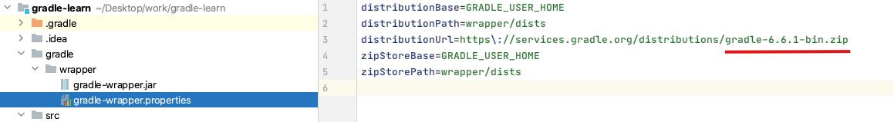
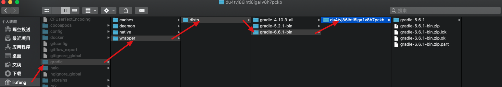
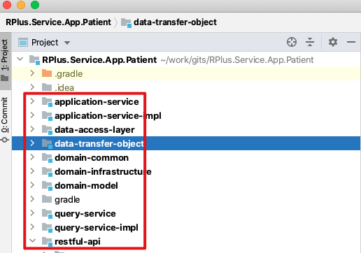

2020年7月9号，在令哥的授意下我开始第一次在后端项目上动手脚，遇到了下面的问题

* import gradle project的时候报错`Cause: zip END header not found`

  > 原因：应该是idea下载gradle包太慢了导致的
  >
  > 解决方案：
  >
  > 1. 查看工程中该文件划红线部分，也就是gradle的版本号
  > 2. 通过迅雷下载该压缩包
  > 3. 将2中下载的压缩包放到如图所示的目录下，并解压
  > 4. 重新import gradle project即可，若还报错可以关闭工程重新打开再import
  
* 一个工程下面有多个黑色加粗的文件夹，每个这样的黑色加粗文件夹下有`src` 文件夹以及一个`build.gradle`文件

  
  
  * 我不知道这个黑色加粗文件夹是什么意思？
  
    > 后来得知那个黑色加粗的叫做一个module（模块）
    
  * 是怎么产生的？
  
    > https://www.jianshu.com/p/491dd13b838f
    
  * 不同文件夹中的文件是什么样的关系？
  
    > ?
    
  * Build.gradle文件用在这里干嘛，是个什么原理？
  
    >?
  
* 运行工程后发现报了一个bean创建失败的错误，原因是这个bean依赖的其他bean找不到，但是！这个工程在别人电脑上就能运行起来啊

  **org.springframework.beans.factory.UnsatisfiedDependencyException: Error creating bean with name 'appInfoRest': Unsatisfied dependency expressed through field 'appInfoApplicationService';**

  * 这是为什么呢？

    > 因为上面提到的某个module没有编译，那为什么没有编译呢？不太清楚。主要是这个整个一套原理加载机制还不太清楚
    >
    > 解决办法：
    >
    > 1. 看这些module下是否有builds目录，没有就说明有问题
    >
    > 
    >
    > 2. 对这个module进行build
    >
    >    
    >
    > 3. 关闭工程后，重新打开，重新导入gradle配置，这个是叫重新导入配置还是叫重新编译来着？

* 工程启动起来后，发现直接在`localhost:port/`后面跟上restcontroller里面的路径没反应

  * 这是为什么呢？

    > 工程中设置了这样一个属性`server.servlet.context-path=/env-console/`，这个东西表示DispatchServlet接受请求的前缀是`/env-console/`,所以RestController中的所有request路径前面都需要跟上`/env-console`

