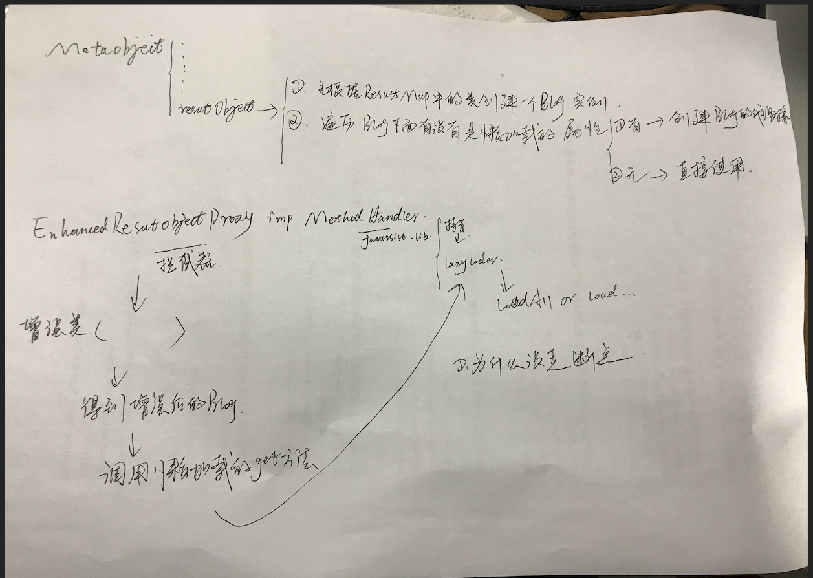

# mybatis 相关

#### 一、XML配置

1. mybatis是一款优秀的持久层框架，支持自定义SQL、存储过程、以及高级映射。它免除了几乎所有的JDBC代码、参数配置过程和结果集获取工作。mybatis可以通过简单的xml或注解来配置和映射原始类型、接口、Java POJO为数据库中的记录

2. 几个关键实例的作用域最佳实践

   > 1. SqlSessionFactoryBuilder：一旦完成SqlSessionFactory的创建就不再需要了，所以其最佳作用域是方法作用域
   >
   > 2. SqlSessionFactory：因为它要再整个应用运行期间不断生成SqlSession，所以其作用域应该是应用作用域。实现方法可以通过单例模式或静态单例模式。
   >
   >   > 1. 何为静态单例模式？
   >
   > 3. SqlSession：**每个线程都应该有自己的SqlSession**，**SqlSession实例不是线程安全的**，因此不能被线程共享，所以它的最佳作用域是**请求作用域**或**方法作用域**
   >
   >   > NOTE：
   >   >
   >   > > 1. 绝对不能将SqlSession放在一个类的静态作域，甚至作为一个类的实例变量也不行
   >   > >
   >   > > 2. 也绝对不能将SqlSession放在任何类型的托管作用域中，比如Servlet框架中的HTTPSession
   >   > >
   >   > >    > 1. 什么是托管作用域？
   >   > >
   >   > > 3. SqlSession使用完毕应及时关闭，
   >   >
   >   > 1. 何为线程安全？什么东西决定了线程安全与否？
   > 
   > 4. 映射器实例（Mapper）:映射器是一些绑定映射语句的**接口**，映射器接口的**实例**是通过SqlSession获取的，映射器实例的作用域虽可与SqlSession的作用域保持一致，但更推荐其作用域为方法作用域，即使用完就丢弃

3. 属性设置的优先级顺序

   > 1. 首先读取`properties` 元素中设置的属性
   >
   > 2. 然后根据`properties`元素中的resource或url属性指定的属性文件来读取属性，并覆盖1中设置的同名属性
   >
   >    ```xml
   >    <properties resource="org/mybatis/example/config.properties">
   >      <property name="username" value="dev_user"/>
   >      <property name="password" value="F2Fa3!33TYyg"/>
   >    </properties>
   >    ```
   >
   > 3. 读取方法参数传入的属性并覆盖之前读取过的同名属性
   >
   >    即：方法参数>属性文件>properties元素

4. 数据源的几种类型，不同数据源下的参数设置及各个参数代表的意义

   > 1. UNPOOLED
   > 2. POOLED
   > 3. JNDI

5. 配置文件下的层级结构

   * <configuration>
     * <properties resource=xx,url=xx>?
       * <property name=xx,value=xx>*
     * <settings>?
       * <setting name=xx,value=xx>+ 这里的name有很多[mybatis设置](https://mybatis.org/mybatis-3/zh/configuration.html#settings)
     * <typeAliases>?
       * <typeAliase type=xx,alias=xx>*
       * <package name=xx>*
     * <typeHandlers>?
       * <typeHandler javaType=xx,jdbcType=xx,handler=xx>*
       * <package>*
     * <objectFactory type=xx>? 对象工厂
       * <property>*
     * <objectWrapperFactory type=xx>?
     * <reflectorFactory type=xx>?
     * <plugins>?
       * <plugin interceptor=xx>+
         * <property>*
     * <environments default=xx(如development)>?
       * <environment id=xx(如development)>+
         * <transactionManager type=xx>
           * <property>*
         * <dataSource type=xx>
           * <property>*
     * <databaseIdProvider type=xx>?
       * <property>*
     * <mappers>?
       * <mapper resource=xx,url=xx,class=xx>*
       * <package>*

   

#### 二、XML映射文件（Mapper）

1. mapper文件下的层级结构

2. 结果映射之**resultMap**

   > 1. 普通结果映射
   >
   > 2. 高级结果映射
   >
   >    > 1. `<association>` 关联
   >    >
   >    >    > 1. 关联的嵌套查询（N+1问题、延迟加载）
   >    >    > 2. 关联的嵌套映射（连表查询）
   >    >    > 3. 关联的多结果集（需要数据库支持多结果集查询才能行）
   >    >
   >    > 2. `<collection>`  集合

3. 缓存

   > 1. select 的结果缓存后，那条数据发生了变更咋整？
   > 2. insert、update、delete会更新缓存，怎么更新法？
   > 3. 缓存会保存列表或对象的1024个引用，这里的引用是什么？
   > 4. 


QUESTIONS:

1. `#`和`$`的区别？

   > [answer](https://www.cnblogs.com/yslf/p/10731951.html)

2. 不通过预处理语句，如何防止SQL注入攻击？

3. insert元素下的keyColumn有什么作用？

4. selectKey元素下的keyColumn有什么作用？

5. 当selectKey元素设置了多个keyProperty时，其内部只返回一个值，会发生什么？

6. id & result

   > 这两者之间的唯一不同是，*id* 元素对应的属性会被标记为对象的标识符，在比较对象实例时使用。 这样可以提高整体的性能，尤其是进行缓存和嵌套结果映射（也就是连接映射）的时候。为什么可以提高整体性能？

7. 关联的嵌套查询

   > MyBatis 能够对这样的查询（N+1查询）进行延迟加载，因此可以将大量语句同时运行的开销分散开来。 然而，如果你加载记录列表之后立刻就遍历列表（立刻遍历的具体表现形式是什么？）以获取嵌套的数据，就会触发所有的延迟加载查询，性能可能会变得很糟糕。
   >
   > > 访问对应懒加载属性
   >
   > 

TIPS：

1. 访问数据库多次、访问数据库一次执行多个语句